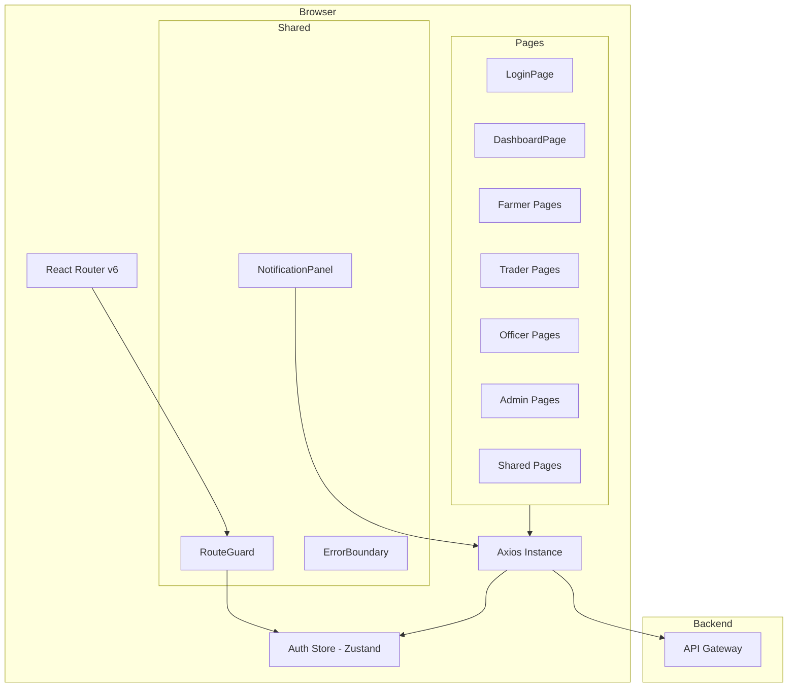
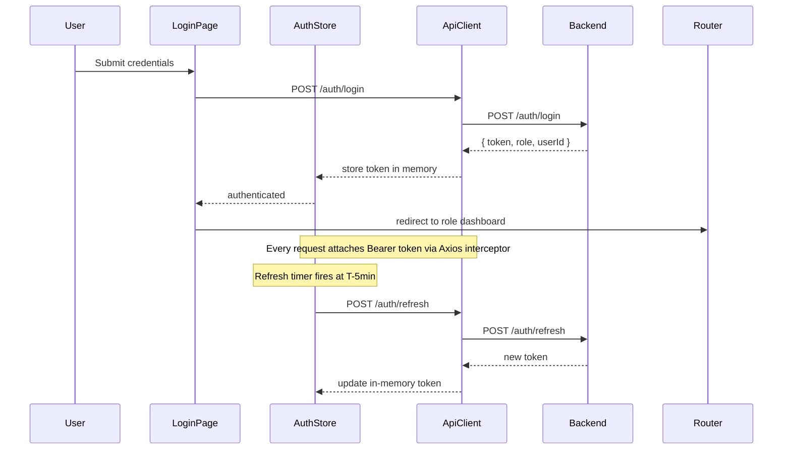

# Design Document: Agri Chain Frontend

## Overview

The Agri Chain Frontend is a React single-page application (SPA) that serves as the user interface for the Agri Chain platform. It communicates exclusively with the existing Spring Boot microservices backend via REST APIs through the API Gateway. The application serves seven distinct roles — Farmer, Trader, Market_Officer, Program_Manager, Administrator, Compliance_Officer, and Government_Auditor — each with a tailored, role-scoped experience.

### Key Design Goals

- **Security**: JWT stored in memory only (never localStorage/sessionStorage), auto-refresh before expiry, Bearer token on every request
- **Role isolation**: Route guards and permission-driven rendering ensure users see only what their role permits
- **Responsiveness**: Usable from 320px mobile to 1920px desktop
- **Accessibility**: Keyboard navigation and ARIA labels on all interactive elements
- **Resilience**: Graceful error handling, connectivity detection, loading states, and retry mechanisms

### Technology Choices

| Concern | Choice | Rationale |
|---|---|---|
| Framework | React 18 + TypeScript | Type safety, large ecosystem, SPA capability |
| Routing | React Router v6 | Declarative routes, nested layouts, loader support |
| State management | Zustand | Lightweight, no boilerplate, easy to scope per domain |
| HTTP client | Axios | Interceptor support for JWT injection and 401/403 handling |
| UI component library | shadcn/ui + Tailwind CSS | Accessible primitives, responsive utilities |
| Form handling | React Hook Form + Zod | Schema-driven validation, minimal re-renders |
| Property-based testing | fast-check | Mature JS PBT library, works with Vitest |
| Unit/integration testing | Vitest + React Testing Library | Fast, ESM-native, component-level testing |
| Build tool | Vite | Fast HMR, optimized production builds |

---

## Architecture

### High-Level Diagram



### Module Structure

```
src/
  api/           # Axios instance + per-service API modules
  components/    # Shared UI components (NotificationPanel, LoadingSpinner, etc.)
  hooks/         # Custom hooks (useAuth, usePolling, useCountdown, etc.)
  pages/         # Route-level page components, organized by role/domain
  stores/        # Zustand stores (auth, notifications)
  types/         # TypeScript interfaces mirroring backend DTOs
  utils/         # Permission matrix, date helpers, file download helpers
  router/        # Route definitions and RouteGuard
```

### Authentication Flow



### Token Lifecycle

- On login: JWT stored in a Zustand store (in-memory, cleared on page unload)
- Axios request interceptor reads the token from the store and sets `Authorization: Bearer <token>`
- A `setTimeout` is set for `(expiry - 5 minutes)` to trigger a silent refresh via `POST /auth/refresh`
- On refresh failure: clear token, redirect to `/login` with `?reason=session_expired`
- On logout: call `POST /auth/logout`, clear token, cancel refresh timer, redirect to `/login`

---

## Components and Interfaces

### Route Guard

A `<RouteGuard>` wrapper component checks the current user's role against the permission matrix before rendering a route. If the role is not permitted, it redirects to `/403`.

```typescript
// Permission matrix — source of truth for all route access decisions
const ROUTE_PERMISSIONS: Record<string, UserRole[]> = {
  '/dashboard':          ['Farmer','Trader','Market_Officer','Program_Manager','Administrator','Compliance_Officer','Government_Auditor'],
  '/profile':            ['Farmer','Trader'],
  '/farmers':            ['Market_Officer','Administrator'],
  '/listings/mine':      ['Farmer'],
  '/listings/browse':    ['Trader','Market_Officer'],
  '/orders/farmer':      ['Farmer'],
  '/orders/trader':      ['Trader'],
  '/transactions':       ['Farmer','Trader','Market_Officer'],
  '/subsidies':          ['Program_Manager','Government_Auditor'],
  '/disbursements':      ['Program_Manager','Government_Auditor'],
  '/compliance':         ['Compliance_Officer'],
  '/audits':             ['Compliance_Officer','Government_Auditor'],
  '/reports':            ['Market_Officer','Program_Manager','Government_Auditor'],
  '/users':              ['Administrator'],
  '/audit-log':          ['Compliance_Officer','Government_Auditor'],
};
```

### Axios Instance and Interceptors

```typescript
// src/api/client.ts
const apiClient = axios.create({ baseURL: import.meta.env.VITE_API_BASE_URL });

// Request interceptor: attach JWT
apiClient.interceptors.request.use(config => {
  const token = useAuthStore.getState().token;
  if (token) config.headers.Authorization = `Bearer ${token}`;
  return config;
});

// Response interceptor: handle 401/403 globally
apiClient.interceptors.response.use(
  res => res,
  err => {
    if (err.response?.status === 401) { clearSessionAndRedirect(); }
    if (err.response?.status === 403) { /* surface access-denied UI */ }
    return Promise.reject(err);
  }
);
```

### Auth Store (Zustand)

```typescript
interface AuthState {
  token: string | null;
  role: UserRole | null;
  userId: string | null;
  refreshTimer: ReturnType<typeof setTimeout> | null;
  login: (credentials: LoginRequest) => Promise<void>;
  logout: () => Promise<void>;
  refresh: () => Promise<void>;
}
```

### Notification Store (Zustand)

```typescript
interface NotificationState {
  notifications: Notification[];
  unreadCount: number;
  fetchNotifications: () => Promise<void>;
  markRead: (id: string) => Promise<void>;
}
```

### Key Shared Components

| Component | Purpose |
|---|---|
| `<RouteGuard>` | Wraps protected routes; redirects on permission failure |
| `<NotificationPanel>` | Bell icon + dropdown; polls every 30s; shows unread count badge |
| `<LoadingSpinner>` | Shown after 500ms for any pending API request |
| `<LoadingSkeleton>` | Dashboard KPI card placeholders during fetch |
| `<ErrorBoundary>` | Catches render errors; shows generic message + correlation ID |
| `<ConnectivityBanner>` | Detects `offline` event; disables form submission |
| `<CountdownTimer>` | Displays remaining time for Pending_Payment transactions |
| `<ToastProvider>` | Global toast notifications for new unread notifications |
| `<FieldError>` | Renders backend field-level validation errors adjacent to inputs |

### Page Components by Role

**Shared (all roles)**
- `LoginPage` — credential form, error display, locked-account message
- `DashboardPage` — role-specific KPI cards from `GET /dashboard`
- `NotificationsPage` — paginated notification history

**Farmer**
- `FarmerRegistrationPage` — public registration form
- `FarmerProfilePage` — view/edit profile, document upload with status badges
- `MyListingsPage` — listing list, create form, pending orders per listing
- `FarmerOrdersPage` — order history with accept/decline actions
- `TransactionsPage` — transaction list with countdown timer and payment form

**Trader**
- `BrowseListingsPage` — paginated/filtered listing grid, order placement form
- `TraderOrdersPage` — order history
- `TransactionsPage` — shared with Farmer; payment submission and polling

**Market Officer**
- `FarmerManagementPage` — pending verification queue, document review
- `ListingApprovalPage` — pending listing queue, approve/reject with reason
- `BrowseListingsPage` — shared with Trader (read-only order placement hidden)
- `TransactionsPage` — shared read-only view

**Program Manager**
- `SubsidyProgramsPage` — program list, create form, activate/close actions
- `DisbursementsPage` — disbursement list, create form, approve action

**Administrator**
- `UserManagementPage` — user list, role assignment dropdown, deactivate action

**Compliance Officer / Government Auditor**
- `ComplianceRecordsPage` — record list with filters, create form (Compliance_Officer only)
- `AuditsPage` — audit list, create form, findings submission, PDF export
- `AuditLogPage` — paginated audit log with date/action/resource filters
- `ReportsPage` — report generation form, history list, CSV/PDF export

---

## Data Models

TypeScript interfaces mirror the backend DTOs. All IDs are UUIDs (string).

```typescript
// Auth
interface LoginRequest { username: string; password: string; }
interface LoginResponse { token: string; role: UserRole; userId: string; expiresAt: string; }

// Farmer
interface FarmerProfile {
  id: string; userId: string; name: string; dateOfBirth: string;
  gender: string; address: string; contactInfo: string; landDetails: string;
  status: 'Pending_Verification' | 'Active' | 'Inactive';
}
interface FarmerDocument {
  id: string; farmerId: string;
  documentType: 'National_ID' | 'Land_Title' | 'Tax_Certificate';
  verificationStatus: 'Pending' | 'Verified' | 'Rejected';
  rejectionReason?: string; uploadedAt: string;
}

// Crop
interface CropListing {
  id: string; farmerId: string; cropType: string;
  quantity: number; pricePerUnit: number; location: string;
  status: 'Pending_Approval' | 'Active' | 'Rejected' | 'Closed';
  rejectionReason?: string; createdAt: string;
}
interface Order {
  id: string; listingId: string; traderId: string;
  quantity: number; status: 'Pending' | 'Confirmed' | 'Declined' | 'Cancelled';
  createdAt: string;
}

// Transaction
interface Transaction {
  id: string; orderId: string; amount: number;
  status: 'Pending_Payment' | 'Settled' | 'Cancelled';
  createdAt: string; expiresAt: string;
}
interface Payment {
  id: string; transactionId: string;
  method: 'Bank_Transfer' | 'Mobile_Money' | 'Card';
  status: 'Processing' | 'Completed' | 'Failed';
  failureReason?: string; createdAt: string;
}

// Subsidy
interface SubsidyProgram {
  id: string; title: string; description: string;
  startDate: string; endDate: string; budgetAmount: number;
  totalDisbursed: number; status: 'Draft' | 'Active' | 'Closed';
}
interface Disbursement {
  id: string; programId: string; farmerId: string; amount: number;
  status: 'Pending' | 'Approved' | 'Disbursed' | 'Failed';
  approvedBy?: string; approvedAt?: string; programCycle: string;
}

// Compliance
interface ComplianceRecord {
  id: string; entityType: string; entityId: string;
  checkResult: 'Pass' | 'Fail'; checkDate: string; notes: string;
}
interface Audit {
  id: string; scope: string;
  status: 'In_Progress' | 'Completed';
  findings?: string; initiatedBy: string; initiatedAt: string; completedAt?: string;
}

// Notification
interface Notification {
  id: string; channel: 'In_App' | 'SMS' | 'Email';
  message: string; status: 'Pending' | 'Delivered' | 'Read' | 'Failed';
  createdAt: string; readAt?: string;
}

// Dashboard
interface DashboardKPIs {
  totalActiveFarmers: number; totalCropListings: number;
  totalTransactionVolume: number; totalSubsidyDisbursed: number;
}

// User (Admin)
interface User {
  id: string; username: string; email: string;
  role: UserRole; status: 'Active' | 'Locked' | 'Inactive';
}
```

### Polling Strategy

Two polling loops run while the user is authenticated:

| Loop | Endpoint | Interval | Purpose |
|---|---|---|---|
| Notification poll | `GET /notifications/me` | 30 seconds | Update unread count, trigger toast on new items |
| Payment status poll | `GET /payments/{id}` | 10 seconds | Detect Completed/Failed after payment submission |

Both loops are implemented via a `usePolling(fn, interval, active)` custom hook that clears the interval on component unmount or when `active` becomes false.

### Countdown Timer

The `<CountdownTimer>` component receives `expiresAt` (ISO string) and computes remaining seconds via `useCountdown`. When the countdown reaches zero it fires a callback that sets the transaction status to `Cancelled` in local state and disables the payment form. The timer is implemented with `setInterval` at 1-second resolution and cleared on unmount.


---

## Correctness Properties

*A property is a characteristic or behavior that should hold true across all valid executions of a system — essentially, a formal statement about what the system should do. Properties serve as the bridge between human-readable specifications and machine-verifiable correctness guarantees.*

### Property 1: Successful login stores token and redirects

*For any* valid login response containing a JWT, role, and userId, the Auth_Module should store the token in the auth store (not in localStorage or sessionStorage) and the router should navigate to the role-specific dashboard route.

**Validates: Requirements 1.1**

---

### Property 2: Authentication errors produce a generic, non-revealing message

*For any* failed login response (wrong username, wrong password, or both), the error message displayed to the user should be identical regardless of which field was incorrect, and the username field value should be preserved.

**Validates: Requirements 1.2**

---

### Property 3: Every authenticated request carries the Bearer token

*For any* API request made while the auth store contains a token, the outgoing HTTP request should include an `Authorization: Bearer <token>` header whose value matches the stored token.

**Validates: Requirements 1.7**

---

### Property 4: Logout clears the session

*For any* authenticated session, after the logout action completes, the auth store token should be null and the router should navigate to `/login`.

**Validates: Requirements 1.3**

---

### Property 5: Role-based rendering shows only permitted elements

*For any* user role, the rendered navigation menu should contain exactly the routes permitted for that role by the permission matrix, and action buttons for operations outside the role's permissions should be absent or disabled.

**Validates: Requirements 2.1, 2.4**

---

### Property 6: Route guards redirect unauthorized navigation

*For any* (role, route) pair where the role is not in the route's permission list, the RouteGuard should redirect the user to `/403` rather than rendering the route's page component.

**Validates: Requirements 2.2**

---

### Property 7: 403 API responses show access-denied without leaking data

*For any* API response with HTTP status 403, the frontend should display the access-denied message and no data from the response body should be rendered in the UI.

**Validates: Requirements 2.3**

---

### Property 8: Field-level errors are displayed adjacent to their fields

*For any* backend error response containing a list of field-level validation errors (400 Bad Request), each error message should be rendered adjacent to the corresponding form field, and every field named in the error list should be highlighted.

**Validates: Requirements 3.2, 14.3**

---

### Property 9: Farmer profile renders all fields

*For any* farmer profile object returned by the API, all profile fields (name, date of birth, gender, address, contact info, land details, status) should be present in the rendered output.

**Validates: Requirements 3.5**

---

### Property 10: Document verification status badges match API data

*For any* list of farmer documents, the VerificationStatus badge displayed for each document should exactly match the `verificationStatus` value in the API response.

**Validates: Requirements 3.7**

---

### Property 11: Status-filtered queues show only matching items

*For any* list of entities (farmers, crop listings) fetched from the API, a queue filtered to a specific status (e.g., Pending_Verification, Pending_Approval) should display only items whose status matches the filter target.

**Validates: Requirements 4.1, 13.1**

---

### Property 12: Rejection actions require a non-empty reason

*For any* rejection action (document rejection, listing rejection), attempting to submit without entering a rejection reason should prevent the API call from being made and display a validation error.

**Validates: Requirements 4.3, 13.3**

---

### Property 13: Entity status updates are reflected in local state without page reload

*For any* successful API response to a status-changing action (order accept/decline, farmer status update, listing approval/rejection), the local component state should reflect the new status immediately without a full page reload.

**Validates: Requirements 4.4, 5.7, 5.8, 13.4**

---

### Property 14: Listing filter controls produce matching query parameters

*For any* combination of filter values (crop type, location, price range), the query parameters sent in the `GET /listings` request should exactly match the selected filter values.

**Validates: Requirements 6.2**

---

### Property 15: Transaction list renders all required fields

*For any* transaction object, the rendered row should include transaction status, amount, and linked order details.

**Validates: Requirements 7.1**

---

### Property 16: Countdown timer displays correct remaining time

*For any* transaction with a future `expiresAt` timestamp, the countdown timer should display a value equal to `expiresAt - now` (within 1-second resolution), and when `expiresAt` is in the past the timer should show zero and the payment form should be disabled.

**Validates: Requirements 7.3, 7.4**

---

### Property 17: Payment polling stops on terminal status

*For any* payment that transitions to `Completed` or `Failed` status, the polling loop should stop making further requests to `GET /payments/{id}` after receiving the terminal status.

**Validates: Requirements 7.5**

---

### Property 18: Status-driven action buttons match entity state

*For any* entity with a status field (SubsidyProgram, Disbursement, Audit), the action buttons rendered should correspond exactly to the actions permitted for that status — Activate for Draft programs, Close for Active programs, Approve for Pending disbursements, Submit Findings for In_Progress audits, Export PDF for Completed audits.

**Validates: Requirements 8.3, 8.4, 8.7, 9.4, 9.5**

---

### Property 19: Remaining budget is computed correctly

*For any* subsidy program, the remaining budget displayed should equal `budgetAmount - totalDisbursed` as returned by the API.

**Validates: Requirements 8.5**

---

### Property 20: Unread notification count matches notification data

*For any* list of notifications, the unread count badge in the Notification_Panel should equal the number of notifications whose status is not `Read`.

**Validates: Requirements 11.1**

---

### Property 21: Marking a notification read updates local state

*For any* unread notification, after the user clicks it and the `PUT /notifications/{id}/read` call succeeds, the notification's status in local state should be `Read` and the unread count should decrease by one.

**Validates: Requirements 11.3**

---

### Property 22: Notification polling fires at 30-second intervals

*For any* authenticated session, the notification polling hook should invoke `GET /notifications/me` at intervals of 30 seconds (±500ms tolerance), and should stop polling when the user logs out.

**Validates: Requirements 11.4**

---

### Property 23: New unread notifications trigger a toast

*For any* polling response that contains notifications with IDs not previously seen and status not `Read`, a toast message should be displayed containing the notification's message content.

**Validates: Requirements 11.5**

---

### Property 24: User list renders role and status for every user

*For any* list of users returned by the API, each rendered row should include the user's current role and status.

**Validates: Requirements 12.1**

---

### Property 25: Loading indicator appears after 500ms

*For any* API request that has not resolved within 500ms, a loading indicator should be visible in the UI; the indicator should be removed once the request resolves.

**Validates: Requirements 14.2**

---

### Property 26: 500 errors display generic message with correlation ID

*For any* API response with HTTP status 500, the frontend should display a generic error message; if the response body contains a correlation ID, that ID should be included in the displayed message, and no stack trace or internal detail should be shown.

**Validates: Requirements 14.4**

---

### Property 27: Interactive elements have ARIA labels

*For any* interactive element (button, input, link, select) rendered by the application, the element should have an accessible name derivable from an `aria-label`, `aria-labelledby`, or associated `<label>` element.

**Validates: Requirements 14.7**

---

### Property 28: Dashboard KPI cards render all required metrics

*For any* dashboard API response, all four KPI cards (total active farmers, total crop listings, total transaction volume, total subsidy disbursed) should be rendered with values matching the API response.

**Validates: Requirements 10.1**

---

### Property 29: Report polling stops on terminal status

*For any* report generation request, the polling loop should continue until the report status is terminal (ready or failed), and should stop making further requests once a terminal status is received.

**Validates: Requirements 10.4**

---

## Error Handling

### Authentication Errors

- **401 Unauthorized**: The Axios response interceptor clears the auth store and redirects to `/login?reason=unauthorized`. No partial data is rendered.
- **423 Locked**: The login form displays a locked-account message directing the user to check their registered email. The form is disabled.
- **Refresh failure**: If `POST /auth/refresh` returns any non-2xx response, the auth store is cleared and the user is redirected to `/login?reason=session_expired`.

### Authorization Errors

- **403 Forbidden**: The Axios response interceptor surfaces an access-denied banner. The response body is discarded and never rendered.
- **Route guard redirect**: Unauthorized direct URL navigation redirects to `/403` which displays a friendly "Access Denied" page with a link back to the dashboard.

### Validation Errors

- **400 Bad Request with field errors**: The API error response is parsed for a `fields` array. Each entry is mapped to the corresponding form field via React Hook Form's `setError`. A summary banner lists all field names.
- **400 without field errors**: A generic form-level error message is displayed.
- **409 Conflict (duplicate)**: Specific messages are shown — e.g., "Contact information is already registered" for duplicate farmer contact.
- **422 Unprocessable Entity (budget exceeded)**: The disbursement form displays the budget-exceeded message inline.

### Network and Server Errors

- **500 Internal Server Error**: A generic error message is shown. If the response body contains `correlationId`, it is appended: "Error reference: {correlationId}". Stack traces are never rendered.
- **Network offline**: The browser `offline` event triggers the `<ConnectivityBanner>` which disables all form submit buttons until the `online` event fires.
- **Request timeout (>500ms)**: The `<LoadingSpinner>` appears after a 500ms `setTimeout` that is cancelled if the request resolves first.

### File Export Errors

- **PDF/CSV export timeout (>10s)**: A 10-second `AbortController` timeout cancels the request and displays an error message: "Export is taking too long. Please try again."
- **Export failure**: The error message from the backend is displayed inline near the export button.

---

## Testing Strategy

### Dual Testing Approach

Both unit tests and property-based tests are required and complementary:

- **Unit tests**: Verify specific examples, integration points, and edge cases
- **Property tests**: Verify universal properties across randomly generated inputs

### Property-Based Testing

**Library**: [fast-check](https://fast-check.dev/) — a mature, TypeScript-native PBT library that integrates with Vitest.

Each property test must:
- Run a minimum of **100 iterations** per test execution (`numRuns: 100`)
- Be tagged with a comment referencing the design property it validates
- Tag format: `// Feature: agri-chain-frontend, Property {N}: {property_text}`
- Each correctness property in this document must be implemented by exactly one property-based test

**Example (Vitest + fast-check):**
```typescript
// Feature: agri-chain-frontend, Property 5: Role-based rendering shows only permitted elements
it('renders only permitted nav items for each role', () => {
  fc.assert(fc.property(
    fc.constantFrom(...ALL_ROLES),
    (role) => {
      const { getAllByRole } = render(<NavMenu role={role} />);
      const links = getAllByRole('link').map(l => l.getAttribute('href'));
      const permitted = getPermittedRoutes(role);
      return links.every(l => permitted.includes(l)) && permitted.every(p => links.includes(p));
    }
  ), { numRuns: 100 });
});
```

### Unit Testing

Unit tests focus on:
- Specific flow examples: login success, logout, session expiry redirect
- Edge cases: countdown reaching zero, payment polling stopping on terminal status, 10-second export timeout
- Integration points: Axios interceptor attaching token, 401 triggering redirect, 403 discarding response body
- Error condition examples: 423 locked response, 500 with correlation ID, network offline banner

Avoid duplicating what property tests already cover broadly.

### Property Test Coverage Map

| Property | Requirement(s) | Pattern |
|---|---|---|
| 1 — Login stores token and redirects | 1.1 | Round-trip |
| 2 — Auth errors are generic | 1.2 | Error condition |
| 3 — Every request carries Bearer token | 1.7 | Invariant |
| 4 — Logout clears session | 1.3 | State transition |
| 5 — Role-based rendering | 2.1, 2.4 | Invariant |
| 6 — Route guards redirect unauthorized | 2.2 | Invariant |
| 7 — 403 shows access-denied without data | 2.3 | Error condition |
| 8 — Field errors displayed adjacent to fields | 3.2, 14.3 | Invariant |
| 9 — Farmer profile renders all fields | 3.5 | Invariant |
| 10 — Document status badges match API data | 3.7 | Round-trip |
| 11 — Status-filtered queues show only matching items | 4.1, 13.1 | Metamorphic |
| 12 — Rejection requires non-empty reason | 4.3, 13.3 | Error condition |
| 13 — Status updates reflected without page reload | 4.4, 5.7, 5.8, 13.4 | State transition |
| 14 — Filter controls produce matching query params | 6.2 | Round-trip |
| 15 — Transaction list renders required fields | 7.1 | Invariant |
| 16 — Countdown timer accuracy | 7.3, 7.4 | Invariant |
| 17 — Payment polling stops on terminal status | 7.5 | Invariant |
| 18 — Status-driven action buttons | 8.3, 8.4, 8.7, 9.4, 9.5 | Invariant |
| 19 — Remaining budget computed correctly | 8.5 | Metamorphic |
| 20 — Unread count matches notification data | 11.1 | Invariant |
| 21 — Mark read updates local state | 11.3 | State transition |
| 22 — Notification polling interval | 11.4 | Invariant |
| 23 — New notifications trigger toast | 11.5 | Invariant |
| 24 — User list renders role and status | 12.1 | Invariant |
| 25 — Loading indicator after 500ms | 14.2 | Invariant |
| 26 — 500 errors show generic message + correlation ID | 14.4 | Error condition |
| 27 — Interactive elements have ARIA labels | 14.7 | Invariant |
| 28 — Dashboard KPI cards render all metrics | 10.1 | Invariant |
| 29 — Report polling stops on terminal status | 10.4 | Invariant |
