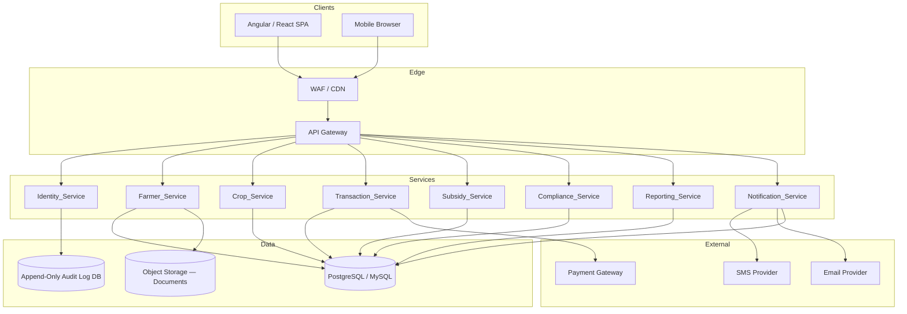

# Design Document: Agri Chain

## Overview

Agri Chain is a cloud-deployable, microservices-based web platform for agricultural departments, cooperatives, and market boards. It connects farmers, traders, and government officials across the agricultural supply chain — from farmer registration and crop listing through order placement, payment settlement, subsidy disbursement, and compliance auditing.

The platform is designed for nationwide scale (200,000 concurrent users), high availability (99.9% uptime), and regulatory compliance (audit trails, data encryption, RBAC). It exposes REST APIs consumed by Angular or React frontends and integrates with external payment gateways and notification channels (SMS, email, in-app).

### Key Design Goals

- Traceability: every state-changing action produces an immutable audit log entry
- Separation of concerns: each business domain is an independent microservice
- Security by default: TLS in transit, AES-256 at rest, salted password hashing, RBAC on every endpoint
- Scalability: stateless services behind an API Gateway, horizontally scalable, with a CDN/WAF layer

---

## Architecture

### High-Level Diagram



### Communication Patterns

- Synchronous REST calls between the API Gateway and each service for user-facing operations
- Inter-service calls (e.g., Crop_Service → Notification_Service) are synchronous REST with circuit-breaker patterns
- The API Gateway enforces TLS termination, rate limiting, and JWT validation (delegating to Identity_Service)
- All services emit structured logs to a centralized logging platform (e.g., ELK / CloudWatch)

### Deployment

- Containerized services (Docker) orchestrated via Kubernetes or a managed container service
- Horizontal pod autoscaling triggered by CPU/memory thresholds to handle 200k concurrent users
- PostgreSQL (or MySQL / SQL Server) with read replicas for reporting queries
- Object storage (S3-compatible) for farmer documents
- Scheduled maintenance windows communicated ≥24 hours in advance per Requirement 17.3

---

## Components and Interfaces

### Identity_Service

Responsibilities: authentication, session token issuance/invalidation, RBAC enforcement, audit logging.

| Endpoint | Method | Roles | Description |
|---|---|---|---|
| `/auth/login` | POST | Public | Authenticate user, return JWT |
| `/auth/logout` | POST | Any authenticated | Invalidate session token |
| `/auth/refresh` | POST | Any authenticated | Refresh session before expiry |
| `/roles/{userId}` | PUT | Administrator | Assign/modify role |
| `/audit-log` | GET | Compliance_Officer, Government_Auditor | Query audit log entries |

Token strategy: short-lived JWT (30-minute inactivity expiry), stored server-side in a token store for immediate invalidation on logout.

Account lockout: 5 consecutive failures within 10 minutes triggers lock + email notification.

### Farmer_Service

Responsibilities: farmer registration, document upload/verification, profile management.

| Endpoint | Method | Roles | Description |
|---|---|---|---|
| `/farmers` | POST | Public (registration) | Submit registration form |
| `/farmers/{id}` | GET/PUT | Farmer (own), Administrator | View/update profile |
| `/farmers/{id}/documents` | POST | Farmer | Upload document |
| `/farmers/{id}/documents/{docId}/verify` | PUT | Market_Officer | Approve/reject document |
| `/farmers/{id}/status` | PUT | Market_Officer, Administrator | Approve registration or deactivate |

### Crop_Service

Responsibilities: crop listing lifecycle, order placement and management.

| Endpoint | Method | Roles | Description |
|---|---|---|---|
| `/listings` | POST | Farmer (Active, docs verified) | Create crop listing |
| `/listings` | GET | Trader, Market_Officer | Browse/filter active listings |
| `/listings/{id}` | PUT | Farmer (own), Market_Officer | Update or approve/reject listing |
| `/listings/{id}/orders` | POST | Trader | Place order |
| `/orders/{id}/accept` | PUT | Farmer | Accept order |
| `/orders/{id}/decline` | PUT | Farmer | Decline order |

### Transaction_Service

Responsibilities: transaction record creation, payment submission, settlement.

| Endpoint | Method | Roles | Description |
|---|---|---|---|
| `/transactions` | GET | Farmer, Trader, Market_Officer | Query transactions |
| `/transactions/{id}/payments` | POST | Trader | Submit payment |
| `/payments/{id}` | GET | Farmer, Trader | View payment status |

Payment gateway integration: async webhook callback updates Payment and Transaction status.

### Subsidy_Service

Responsibilities: subsidy program lifecycle, disbursement creation and approval.

| Endpoint | Method | Roles | Description |
|---|---|---|---|
| `/programs` | POST | Program_Manager | Create subsidy program |
| `/programs/{id}/activate` | PUT | Program_Manager | Activate program |
| `/programs/{id}/close` | PUT | Program_Manager | Close program |
| `/programs/{id}/disbursements` | POST | Program_Manager | Create disbursement |
| `/disbursements/{id}/approve` | PUT | Authorized approver | Approve disbursement |

### Compliance_Service

Responsibilities: compliance record creation, audit lifecycle, PDF export.

| Endpoint | Method | Roles | Description |
|---|---|---|---|
| `/compliance-records` | POST | Compliance_Officer | Create compliance record |
| `/compliance-records` | GET | Compliance_Officer | Query records by entity |
| `/audits` | POST | Compliance_Officer, Government_Auditor | Initiate audit |
| `/audits/{id}/findings` | PUT | Compliance_Officer, Government_Auditor | Submit findings |
| `/audits/{id}/export` | GET | Government_Auditor | Export audit as PDF |

### Reporting_Service

Responsibilities: KPI dashboards, report generation, CSV/PDF export.

| Endpoint | Method | Roles | Description |
|---|---|---|---|
| `/dashboard` | GET | Program_Manager, Market_Officer, Government_Auditor | KPI summary |
| `/reports` | POST | Authorized roles | Generate report |
| `/reports/{id}/export` | GET | Authorized roles | Export CSV or PDF |

Reporting queries run against read replicas to avoid impacting transactional workloads.

### Notification_Service

Responsibilities: multi-channel notification delivery (in-app, SMS, email), retry logic, history.

| Endpoint | Method | Roles | Description |
|---|---|---|---|
| `/notifications` | POST | Internal services only | Send notification |
| `/notifications/me` | GET | Any authenticated | Query own notification history (paginated) |
| `/notifications/{id}/read` | PUT | Any authenticated | Mark notification as read |

Retry policy: up to 3 retries at 5-minute intervals before marking "Failed".

---

## Data Models

### Identity Domain

```
User
  id            UUID PK
  username      VARCHAR(100) UNIQUE
  password_hash VARCHAR(255)   -- salted hash, never plaintext
  email         VARCHAR(255) UNIQUE  -- AES-256 encrypted at rest
  role          ENUM(Farmer, Trader, Market_Officer, Program_Manager,
                     Administrator, Compliance_Officer, Government_Auditor)
  status        ENUM(Active, Locked, Inactive)
  failed_attempts INT DEFAULT 0
  locked_at     TIMESTAMP NULL
  created_at    TIMESTAMP
  updated_at    TIMESTAMP

AuditLog
  id            UUID PK
  user_id       UUID FK → User.id
  action_type   VARCHAR(50)   -- CREATE, UPDATE, DELETE
  resource_type VARCHAR(100)
  resource_id   UUID
  previous_value JSONB NULL
  new_value      JSONB NULL
  timestamp     TIMESTAMP (UTC)
  -- append-only: no UPDATE or DELETE permitted on this table
```

### Farmer Domain

```
Farmer
  id            UUID PK
  user_id       UUID FK → User.id
  name          VARCHAR(255)  -- AES-256 encrypted
  date_of_birth DATE          -- AES-256 encrypted
  gender        VARCHAR(20)
  address       TEXT          -- AES-256 encrypted
  contact_info  VARCHAR(255) UNIQUE  -- AES-256 encrypted
  land_details  TEXT
  status        ENUM(Pending_Verification, Active, Inactive)
  created_at    TIMESTAMP
  updated_at    TIMESTAMP

FarmerDocument
  id                UUID PK
  farmer_id         UUID FK → Farmer.id
  document_type     ENUM(National_ID, Land_Title, Tax_Certificate)
  storage_path      VARCHAR(500)  -- path in object storage
  verification_status ENUM(Pending, Verified, Rejected)
  reviewed_by       UUID FK → User.id NULL
  reviewed_at       TIMESTAMP NULL
  rejection_reason  TEXT NULL
  uploaded_at       TIMESTAMP
```

### Crop Domain

```
CropListing
  id              UUID PK
  farmer_id       UUID FK → Farmer.id
  crop_type       VARCHAR(100)
  quantity        DECIMAL(12,2)   -- must be > 0
  price_per_unit  DECIMAL(12,2)   -- must be > 0
  location        VARCHAR(255)
  status          ENUM(Pending_Approval, Active, Rejected, Closed)
  rejection_reason TEXT NULL
  created_at      TIMESTAMP
  updated_at      TIMESTAMP

Order
  id              UUID PK
  listing_id      UUID FK → CropListing.id
  trader_id       UUID FK → User.id
  quantity        DECIMAL(12,2)
  status          ENUM(Pending, Confirmed, Declined, Cancelled)
  created_at      TIMESTAMP
  updated_at      TIMESTAMP
```

### Transaction Domain

```
Transaction
  id              UUID PK
  order_id        UUID FK → Order.id UNIQUE
  amount          DECIMAL(14,2)   -- quantity × price_per_unit at confirmation time
  status          ENUM(Pending_Payment, Settled, Cancelled)
  created_at      TIMESTAMP
  expires_at      TIMESTAMP       -- created_at + 48 hours
  updated_at      TIMESTAMP

Payment
  id              UUID PK
  transaction_id  UUID FK → Transaction.id
  method          ENUM(Bank_Transfer, Mobile_Money, Card)
  status          ENUM(Processing, Completed, Failed)
  gateway_ref     VARCHAR(255) NULL
  failure_reason  TEXT NULL
  created_at      TIMESTAMP
  updated_at      TIMESTAMP
```

### Subsidy Domain

```
SubsidyProgram
  id              UUID PK
  title           VARCHAR(255)
  description     TEXT
  start_date      DATE
  end_date        DATE
  budget_amount   DECIMAL(16,2)
  total_disbursed DECIMAL(16,2) DEFAULT 0
  status          ENUM(Draft, Active, Closed)
  created_by      UUID FK → User.id
  created_at      TIMESTAMP
  updated_at      TIMESTAMP

Disbursement
  id              UUID PK
  program_id      UUID FK → SubsidyProgram.id
  farmer_id       UUID FK → Farmer.id
  amount          DECIMAL(14,2)
  status          ENUM(Pending, Approved, Disbursed, Failed)
  approved_by     UUID FK → User.id NULL
  approved_at     TIMESTAMP NULL
  program_cycle   VARCHAR(50)     -- used for duplicate prevention
  created_at      TIMESTAMP
  updated_at      TIMESTAMP
  UNIQUE (farmer_id, program_id, program_cycle)
```

### Compliance Domain

```
ComplianceRecord
  id              UUID PK
  entity_type     VARCHAR(100)
  entity_id       UUID
  check_result    ENUM(Pass, Fail)
  check_date      DATE
  notes           TEXT
  created_by      UUID FK → User.id
  created_at      TIMESTAMP

Audit
  id              UUID PK
  scope           TEXT
  status          ENUM(In_Progress, Completed)
  findings        TEXT NULL
  initiated_by    UUID FK → User.id
  initiated_at    TIMESTAMP
  completed_at    TIMESTAMP NULL
```

### Notification Domain

```
Notification
  id              UUID PK
  user_id         UUID FK → User.id
  channel         ENUM(In_App, SMS, Email)
  message         TEXT
  status          ENUM(Pending, Delivered, Read, Failed)
  retry_count     INT DEFAULT 0
  delivered_at    TIMESTAMP NULL
  read_at         TIMESTAMP NULL
  created_at      TIMESTAMP
```

---

## Correctness Properties

*A property is a characteristic or behavior that should hold true across all valid executions of a system — essentially, a formal statement about what the system should do. Properties serve as the bridge between human-readable specifications and machine-verifiable correctness guarantees.*

### Property 1: Valid credentials always produce a session token

*For any* user with a valid username and correct password, submitting those credentials to the login endpoint should always return a valid session token and never return an authentication error.

**Validates: Requirements 1.1**

---

### Property 2: Invalid credentials never reveal which field was wrong

*For any* login attempt with an incorrect username, incorrect password, or both, the error response body should be identical regardless of which field was wrong — it must not indicate whether the username or password was the source of failure.

**Validates: Requirements 1.2**

---

### Property 3: Invalidated tokens are always rejected

*For any* session token that has been invalidated — either by explicit logout or by expiry after 30 minutes of inactivity — any subsequent authenticated request using that token should be rejected with an authorization error.

**Validates: Requirements 1.3, 1.4**

---

### Property 4: Account lockout after repeated failures

*For any* user account, submitting 5 or more consecutive failed login attempts within a 10-minute window should result in the account transitioning to Locked status, after which further login attempts should be rejected regardless of credential correctness.

**Validates: Requirements 1.5**

---

### Property 5: RBAC rejects all unauthorized endpoint access

*For any* API endpoint and any user whose role does not have explicit permission for that endpoint, the request should be rejected with an authorization error.

**Validates: Requirements 2.1, 2.2**

---

### Property 6: Unauthorized access attempts are always logged

*For any* request that is rejected due to insufficient role permissions, the audit log should contain an entry recording the UserID, the attempted resource, and the UTC timestamp of the attempt.

**Validates: Requirements 2.2**

---

### Property 7: Role changes are reflected in subsequent requests

*For any* user whose role is changed by an Administrator, subsequent API requests made by that user should be evaluated against the new role's permissions, not the previous role's permissions.

**Validates: Requirements 2.3, 2.4**

---

### Property 8: Every state-changing operation produces an audit log entry

*For any* create, update, or delete operation on any system entity, the audit log should contain exactly one new entry recording the UserID, action type, affected resource identifier, previous values (where applicable), and UTC timestamp.

**Validates: Requirements 3.1, 6.1, 7.5**

---

### Property 9: Audit log entries are immutable

*For any* existing audit log entry, any attempt to update or delete that entry — regardless of the requesting user's role — should be rejected.

**Validates: Requirements 3.4**

---

### Property 10: Valid farmer registration creates a Pending Verification record

*For any* registration form containing all mandatory fields (name, date of birth, gender, address, contact information, land details), submitting the form should create a Farmer record with status Pending_Verification.

**Validates: Requirements 4.1**

---

### Property 11: Incomplete registration is rejected with missing field list

*For any* registration form missing one or more mandatory fields, the submission should be rejected and the response should enumerate every missing field.

**Validates: Requirements 4.2**

---

### Property 12: Duplicate contact information is rejected

*For any* registration form whose contact information matches an existing Active Farmer record, the submission should be rejected with a duplicate-record error.

**Validates: Requirements 4.4**

---

### Property 13: Document upload sets VerificationStatus to Pending

*For any* document of a supported type (National_ID, Land_Title, Tax_Certificate) uploaded by a Farmer, the resulting FarmerDocument record should have VerificationStatus Pending.

**Validates: Requirements 5.1**

---

### Property 14: Document verification records reviewer identity and timestamp

*For any* Pending document that a Market_Officer marks as Verified or Rejected, the resulting record should contain the reviewing officer's UserID and the timestamp of the review action.

**Validates: Requirements 5.2, 5.3**

---

### Property 15: Farmers with unverified documents cannot create crop listings

*For any* Farmer whose mandatory documents are not all in Verified status, any attempt to create a CropListing should be rejected.

**Validates: Requirements 5.4**

---

### Property 16: Contact info update requires re-verification before notification use

*For any* Farmer who updates their contact information, the new contact value should not be used as a notification delivery target until it has been re-verified.

**Validates: Requirements 6.2**

---

### Property 17: Valid crop listing is created with Pending Approval status

*For any* crop listing submission by an Active Farmer with all mandatory documents Verified, containing a positive quantity and positive price per unit, the resulting CropListing should have status Pending_Approval.

**Validates: Requirements 7.1**

---

### Property 18: Zero or negative quantity/price is rejected

*For any* crop listing submission where quantity ≤ 0 or price_per_unit ≤ 0, the submission should be rejected with a validation error.

**Validates: Requirements 7.2**

---

### Property 19: Crop listing filter returns only Active listings matching all criteria

*For any* query with optional filters (crop type, location, price range), the response should contain only CropListings whose status is Active and that satisfy every specified filter condition.

**Validates: Requirements 8.1**

---

### Property 20: Order quantity is validated against available listing quantity

*For any* order placement, if the requested quantity does not exceed the CropListing's available quantity, an Order record with status Pending should be created; if the requested quantity exceeds the available quantity, the order should be rejected with an insufficient-quantity error.

**Validates: Requirements 8.2, 8.3**

---

### Property 21: Farmer acceptance reduces available listing quantity

*For any* Pending order that a Farmer accepts, the Order status should become Confirmed and the CropListing's available quantity should decrease by exactly the ordered amount.

**Validates: Requirements 8.5**

---

### Property 22: Confirmed order creates a Transaction with correct amount

*For any* Order that transitions to Confirmed status, exactly one Transaction record should be created with status Pending_Payment and an amount equal to the confirmed order quantity multiplied by the CropListing's price_per_unit at the time of confirmation.

**Validates: Requirements 9.1, 9.2**

---

### Property 23: Payment gateway success settles the transaction

*For any* Payment record for which the payment gateway returns a success confirmation, the Payment status should become Completed and the linked Transaction status should become Settled.

**Validates: Requirements 10.2**

---

### Property 24: Payment gateway failure marks payment as failed

*For any* Payment record for which the payment gateway returns a failure response, the Payment status should become Failed and the failure reason should be recorded.

**Validates: Requirements 10.3**

---

### Property 25: Pending payment is auto-cancelled after 48 hours

*For any* Transaction in Pending_Payment status whose expires_at timestamp has passed, the Transaction status should be Cancelled and no further payment submissions should be accepted.

**Validates: Requirements 10.5**

---

### Property 26: Subsidy program status transitions are monotonic

*For any* SubsidyProgram, the status should only advance in the sequence Draft → Active → Closed; no backward transitions should be permitted.

**Validates: Requirements 11.1, 11.2, 11.3**

---

### Property 27: Total disbursed never exceeds program budget

*For any* SubsidyProgram and any sequence of disbursement approvals, the sum of all Approved and Disbursed amounts should never exceed the program's budget_amount; any disbursement that would cause the total to exceed the budget should be rejected.

**Validates: Requirements 11.4, 11.5**

---

### Property 28: Duplicate disbursement for same farmer/program/cycle is rejected

*For any* existing Disbursement record, attempting to create another Disbursement with the same FarmerID, ProgramID, and program_cycle should be rejected.

**Validates: Requirements 12.5**

---

### Property 29: Compliance record is linked to the specified entity

*For any* compliance record creation, querying ComplianceRecords by the specified entity_type and entity_id should return the newly created record.

**Validates: Requirements 13.1**

---

### Property 30: Audit record transitions correctly through its lifecycle

*For any* Audit record, initiating an audit should set status to In_Progress; submitting findings should set status to Completed; no other status transitions should be permitted.

**Validates: Requirements 14.1, 14.2**

---

### Property 31: Dashboard response includes all required KPI fields

*For any* authorized dashboard request, the response should include total active farmers, total crop listings, total transaction volume, and total subsidy disbursed.

**Validates: Requirements 15.1**

---

### Property 32: Report metadata is persisted on generation

*For any* generated report, querying report metadata should return a record containing the scope, the generating user's ID, and the generation timestamp.

**Validates: Requirements 15.4**

---

### Property 33: Notification delivered via the channel specified in the request

*For any* notification request specifying a channel (In_App, SMS, Email), the notification should be delivered via that channel and no other.

**Validates: Requirements 16.1**

---

### Property 34: Notification retry count never exceeds 3

*For any* notification whose delivery fails, the system should retry delivery at most 3 times; after 3 failed attempts the notification status should be Failed and no further retries should occur.

**Validates: Requirements 16.3**

---

### Property 35: Notification history pages contain at most 50 records

*For any* notification history query, each returned page should contain at most 50 notification records.

**Validates: Requirements 16.5**

---

### Property 36: Passwords are never stored as plaintext

*For any* user registration or password change, the value stored in the database for the password field should not equal the plaintext password submitted in the request.

**Validates: Requirements 18.3**

---

## Error Handling

### Authentication and Authorization Errors

- `401 Unauthorized` — missing or invalid/expired token; response body must not reveal token internals
- `403 Forbidden` — valid token but insufficient role permissions; audit log entry created
- `423 Locked` — account locked due to repeated failures; response includes support contact

### Validation Errors

- `400 Bad Request` — returned for all input validation failures (missing fields, invalid values, duplicate records); response body includes a structured list of field-level errors
- Crop listing with quantity ≤ 0 or price ≤ 0 returns `400` with a `VALIDATION_ERROR` code
- Order quantity exceeding available listing quantity returns `409 Conflict` with `INSUFFICIENT_QUANTITY` code

### Business Rule Violations

- `409 Conflict` — duplicate farmer contact info, duplicate disbursement for same farmer/program/cycle
- `422 Unprocessable Entity` — disbursement exceeds program budget (`BUDGET_EXCEEDED`), operation on entity in wrong state (e.g., creating disbursement under a Closed program)

### External Integration Errors

- Payment gateway failures are captured in the Payment record (`status = Failed`, `failure_reason` populated) and surfaced to the Trader via notification; the Transaction remains in `Pending_Payment` until the 48-hour window expires or a new payment attempt succeeds
- Notification delivery failures trigger the retry mechanism (up to 3 retries at 5-minute intervals); after exhaustion, status is set to `Failed` and the originating service is not blocked

### Service-to-Service Errors

- Inter-service calls use circuit breakers; if a downstream service (e.g., Notification_Service) is unavailable, the calling service logs the failure and returns a partial success response rather than failing the entire operation
- All unhandled exceptions are caught at the API Gateway level and returned as `500 Internal Server Error` with a correlation ID for log tracing; stack traces are never exposed to clients

---

## Testing Strategy

### Dual Testing Approach

Both unit tests and property-based tests are required. They are complementary:

- Unit tests verify specific examples, integration points, and edge cases
- Property-based tests verify universal correctness across randomly generated inputs

### Unit Testing

Unit tests should focus on:

- Specific state transition examples (e.g., a single farmer registration flow end-to-end)
- Integration points between services (e.g., Crop_Service calling Notification_Service on order creation)
- Edge cases: account lockout at exactly the 5th attempt, transaction auto-cancellation at exactly 48 hours, disbursement at exactly the budget limit
- Error condition examples: payment gateway failure response handling, document rejection flow

Avoid writing unit tests that duplicate what property tests already cover broadly.

### Property-Based Testing

**Library selection by backend technology:**
- Spring Boot: [jqwik](https://jqwik.net/) or [QuickTheories](https://github.com/quicktheories/QuickTheories)
- .NET Core: [FsCheck](https://fscheck.github.io/FsCheck/) or [CsCheck](https://github.com/AnthonyLloyd/CsCheck)

Each property test must:
- Run a minimum of **100 iterations** per test execution
- Be tagged with a comment referencing the design property it validates
- Tag format: `// Feature: agri-chain, Property {N}: {property_text}`
- Each correctness property in this document must be implemented by exactly one property-based test

**Example tag (Java/jqwik):**
```java
// Feature: agri-chain, Property 20: Order quantity is validated against available listing quantity
@Property(tries = 100)
void orderQuantityValidation(@ForAll("validOrders") OrderRequest order,
                              @ForAll("cropListings") CropListing listing) { ... }
```

**Example tag (C#/FsCheck):**
```csharp
// Feature: agri-chain, Property 22: Confirmed order creates a Transaction with correct amount
[Property(MaxTest = 100)]
Property ConfirmedOrderCreatesTransactionWithCorrectAmount() { ... }
```

### Property Test Coverage Map

| Property | Requirement(s) | Pattern |
|---|---|---|
| 1 — Valid credentials produce token | 1.1 | Round-trip |
| 2 — Invalid credentials generic error | 1.2 | Error condition |
| 3 — Invalidated tokens rejected | 1.3, 1.4 | Invariant |
| 4 — Account lockout after failures | 1.5 | State transition |
| 5 — RBAC rejects unauthorized access | 2.1, 2.2 | Invariant |
| 6 — Unauthorized attempts logged | 2.2 | Side-effect invariant |
| 7 — Role changes reflected immediately | 2.3, 2.4 | State transition |
| 8 — State-changing ops produce audit entry | 3.1, 6.1, 7.5 | Invariant |
| 9 — Audit log entries are immutable | 3.4 | Invariant |
| 10 — Valid registration → Pending Verification | 4.1 | Round-trip |
| 11 — Incomplete registration rejected | 4.2 | Error condition |
| 12 — Duplicate contact info rejected | 4.4 | Invariant |
| 13 — Document upload → Pending | 5.1 | Round-trip |
| 14 — Verification records reviewer + timestamp | 5.2, 5.3 | Invariant |
| 15 — Unverified docs block crop listing | 5.4 | Guard invariant |
| 16 — Contact update requires re-verification | 6.2 | Guard invariant |
| 17 — Valid listing → Pending Approval | 7.1 | Round-trip |
| 18 — Zero/negative quantity or price rejected | 7.2 | Error condition |
| 19 — Filter returns only Active matching listings | 8.1 | Metamorphic |
| 20 — Order quantity validated | 8.2, 8.3 | Invariant + edge case |
| 21 — Acceptance reduces listing quantity | 8.5 | Invariant |
| 22 — Confirmed order → Transaction with correct amount | 9.1, 9.2 | Round-trip + computation |
| 23 — Gateway success settles transaction | 10.2 | State transition |
| 24 — Gateway failure marks payment failed | 10.3 | State transition |
| 25 — Pending payment auto-cancelled at 48h | 10.5 | Time-based invariant |
| 26 — Program status transitions are monotonic | 11.1–11.3 | State machine invariant |
| 27 — Total disbursed never exceeds budget | 11.4, 11.5 | Invariant + edge case |
| 28 — Duplicate disbursement rejected | 12.5 | Invariant |
| 29 — Compliance record linked to entity | 13.1 | Round-trip |
| 30 — Audit lifecycle transitions | 14.1, 14.2 | State machine invariant |
| 31 — Dashboard includes all KPI fields | 15.1 | Invariant |
| 32 — Report metadata persisted | 15.4 | Round-trip |
| 33 — Notification delivered via specified channel | 16.1 | Invariant |
| 34 — Retry count never exceeds 3 | 16.3 | Invariant |
| 35 — Notification history pages ≤ 50 records | 16.5 | Invariant |
| 36 — Passwords never stored as plaintext | 18.3 | Invariant |
