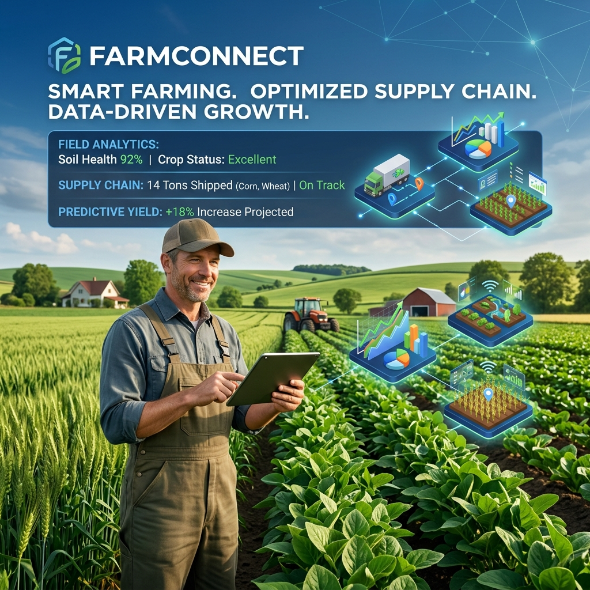

# FarmConnect: Enterprise Agricultural Supply Chain Ecosystem



[](https://github.com/SamppurnaTH/FarmConnect/actions)
[](https://github.com/SamppurnaTH/FarmConnect/actions)
[](https://opensource.org/licenses/MIT)
[]()

**FarmConnect** is a decentralized, resilient, and enterprise-grade agritech platform designed to digitize the entire agricultural value chain. By bridging the gap between farmers, traders, and government programs, it provides a unified source of truth for market transactions, subsidy management, and regulatory compliance.

---

## ✨ Key Value Propositions

- **Transparency**: End-to-end traceability of agricultural produce from farm to market.
- **Efficiency**: Automated subsidy allocation and eligibility verification using institutional data.
- **Scalability**: Cloud-native microservices architecture capable of handling high-concurrency transactions.
- **Security**: Robust identity management and audit trails for every stakeholder interaction.

---

## 🏗️ Technical Architecture

FarmConnect is built on a **High-Concurrency Microservices Architecture**, ensuring domain isolation, horizontal scalability, and fault tolerance.

### Service Mesh & Orchestration
The ecosystem comprises specialized Spring Boot microservices, coordinated via a robust container orchestration layer:

| Domain | Service | Responsibilities |
| :--- | :--- | :--- |
| **Edge Gateway** | `gateway-service` | Central Entry Point, Dynamic Routing, Rate Limiting |
| **Discovery** | `eureka-service` | Service Registration, Heartbeat Monitoring, Load Balancing |
| **Identity** | `identity-service` | RBAC, JWT Issuance, OAuth2, Audit Logging |
| **Farmer** | `farmer-service` | Profile Lifecycle, KYC Documents, Land Verification |
| **Marketplace** | `crop-service` | Inventory Management, Price Indexing, Listing Management |
| **Commerce** | `transaction-service` | Secure Trade Execution, Settlement, Digital Ledger Entry |
| **Governance** | `subsidy-service` | Grant Allocation, Eligibility Scoring, Disbursement |
| **Assurance** | `compliance-service` | Automated Verification, Regulatory Checkpoints |
| **Intelligence** | `reporting-service` | KPI Dashboards, Market Analytics, PDF/JSON Reports |
| **Engagement** | `notification-service` | Multi-channel Alerts, Event-driven Status Updates |

---

## 🛠️ Technology Stack

| Component | Technologies |
| :--- | :--- |
| **Core Framework** | Java 17, Spring Boot 3.2.5, Spring Cloud Netflix |
| **Persistence Layer** | PostgreSQL 15, Spring Data JPA |
| **Frontend Ecosystem** | React 18, TypeScript, Vite, Tailwind CSS, Lucide |
| **Security Architecture** | JWT, BCrypt, Spring Security |
| **Infrastructure** | Docker Engine, Docker Compose, Nginx Proxy |
| **DevOps** | GitHub Actions, GHCR (GitHub Container Registry) |

---

## 🚀 Operational Quick-Start

### Prerequisites
- **Runtimes**: Java 17+, Node.js 20+
- **Tooling**: Maven 3.8+, Docker Desktop / Engine
- **Resources**: Minimum 8GB RAM recommended

### Deployment Workflow

1.  **Build Services**:
    ```bash
    cd backend
    mvn clean package -DskipTests
    ```

2.  **Launch Ecosystem**:
    ```bash
    docker-compose up -d --build
    ```

3.  **Access Points**:
    - **Web Portal**: [http://localhost:80](http://localhost:80)
    - **API Gateway**: [http://localhost:8080](http://localhost:8080)
    - **Service Registry**: [http://localhost:8761](http://localhost:8761)

---

## 🔑 Demo Credentials

| Role | Username | Password |
| :--- | :--- | :--- |
| **Administrator** | `admin_demo` | `Admin@1234` |
| **Farmer** | `farmer_demo` | `Farm@1234` |
| **Trader** | `trader_demo` | `Trade@1234` |
| **Market Officer** | `officer_demo` | `Officer@1234` |

---

## 📈 Strategic Roadmap

- [ ] **Blockchain Integration**: Immutable trade tracking via Hyperledger Fabric.
- [ ] **AI Forecasting**: Predictive algorithms for regional crop yield.
- [ ] **IoT Connectivity**: Real-time soil and weather telemetry integration.
- [ ] **Global Reach**: Multi-language support (i18n) for international hubs.

---

## 📄 License
This project is licensed under the **MIT Enterprise License**.

---
© 2026 FarmConnect Platform - Bridging the Digital Divide in Agriculture.
